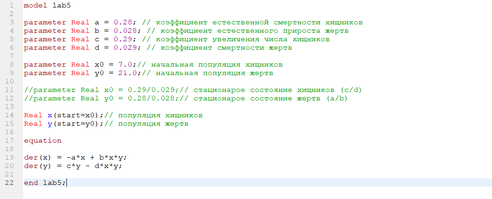
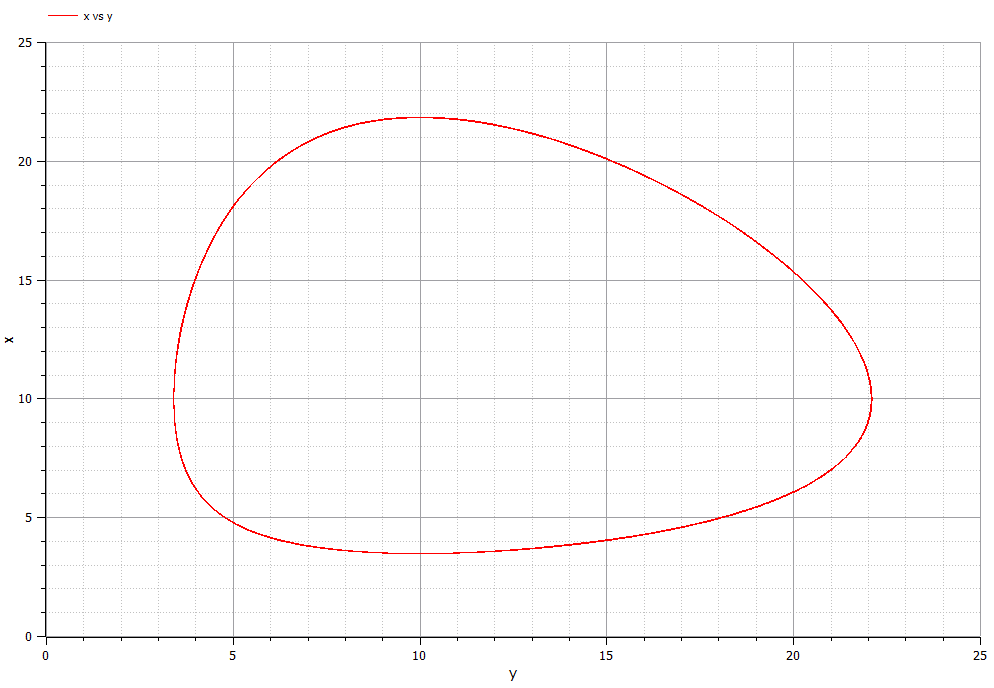
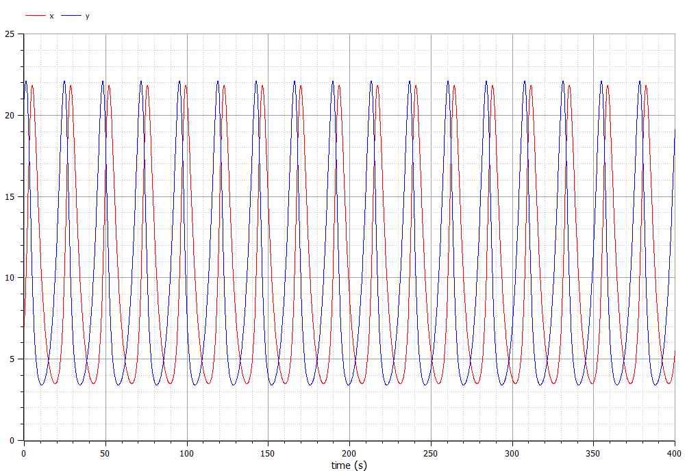
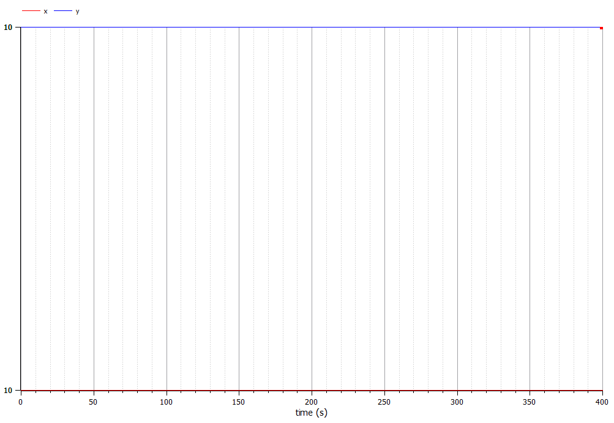

---
# Front matter
lang: ru-RU
title: "Лабораторная работа №3"
subtitle: "Модель хищник-жертва"
author: "Азарцова Полина Валерьевна"

# Formatting
toc-title: "Содержание"
toc: true # Table of contents
toc_depth: 2
lof: true # List of figures
lot: true # List of tables
fontsize: 12pt
linestretch: 1.5
papersize: a4paper
documentclass: scrreprt
polyglossia-lang: russian
polyglossia-otherlangs: english
mainfont: PT Serif
romanfont: PT Serif
sansfont: PT Sans
monofont: PT Mono
mainfontoptions: Ligatures=TeX
romanfontoptions: Ligatures=TeX
sansfontoptions: Ligatures=TeX,Scale=MatchLowercase
monofontoptions: Scale=MatchLowercase
indent: true
pdf-engine: lualatex
header-includes:
  - \linepenalty=10 # the penalty added to the badness of each line within a paragraph (no associated penalty node) Increasing the value makes tex try to have fewer lines in the paragraph.
  - \interlinepenalty=0 # value of the penalty (node) added after each line of a paragraph.
  - \hyphenpenalty=50 # the penalty for line breaking at an automatically inserted hyphen
  - \exhyphenpenalty=50 # the penalty for line breaking at an explicit hyphen
  - \binoppenalty=700 # the penalty for breaking a line at a binary operator
  - \relpenalty=500 # the penalty for breaking a line at a relation
  - \clubpenalty=150 # extra penalty for breaking after first line of a paragraph
  - \widowpenalty=150 # extra penalty for breaking before last line of a paragraph
  - \displaywidowpenalty=50 # extra penalty for breaking before last line before a display math
  - \brokenpenalty=100 # extra penalty for page breaking after a hyphenated line
  - \predisplaypenalty=10000 # penalty for breaking before a display
  - \postdisplaypenalty=0 # penalty for breaking after a display
  - \floatingpenalty = 20000 # penalty for splitting an insertion (can only be split footnote in standard LaTeX)
  - \raggedbottom # or \flushbottom
  - \usepackage{float} # keep figures where there are in the text
  - \floatplacement{figure}{H} # keep figures where there are in the text
---

# Цель работы

Изучение и построение одной из простейших моделей взаимодействия двух видов типа "хищник-жертва", модели Лотки-Вольтерры, с помощью языка программирования Modelica. 

# Задание

1. Построить график зависимости численности хищников от численности жертв.
2. Построить график изменения численности хищников и численности жертв.
3. Найти стационарное состояние системы.

# Выполнение лабораторной работы

Известны начальные условия x0 = 7 и y0 = 21.

Коэффициенты смертности для хищников и для жертв a = 0.28 и d = 0.029 соответственно.  
Коэффициенты прироста популяции для хищников и жертв  c = 0.29 и b = 0.028 соответственно.   
  
Уравнение модели "хищник-жертва" имеет следующий вид:
$$\frac{dx}{dt}=-0,28x(t)+0,028x(t)y(t) $$
$$\frac{dy}{dt}=0,29y(t)-0,029x(t)y(t) $$

1. Ниже представлен скриншот кода программы на языке программирования Modelica. (рис 1. -@fig:001)  

{ #fig:001 width=70% }  

Также ниже представле график зависимости численности хищников от численности жертв. (рис 2. -@fig:001)  

{ #fig:001 width=70% }    

2. Получили графики изменения численности хищников и численности жертв с течением веремени. (рис 3. -@fig:001) 

{ #fig:001 width=70% }  

3. Чтобы найти стационарное состояние системы, необходимо приравнять производные функций x и y к нулю и выразить их значения.

Получили следующие значения:
$$ x_0 = \frac{b}{d} = \frac{0.29}{0.029} \ = 10  $$
$$ y_0 = \frac{a}{c} = \frac{0.28}{0.028} \ = 10  $$

При стационарном состоянии значения числа жертв и хищников не меняется со временем. (рис 4. -@fig:001)  

{ #fig:001 width=70% }  

# Выводы

Ознакомилась с одной из простейши моделей взаимодействия двух видов "хищник - жертва", построив для неё графики и найдя стационарное состояние системы.